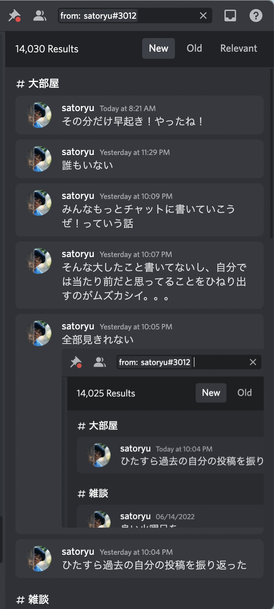
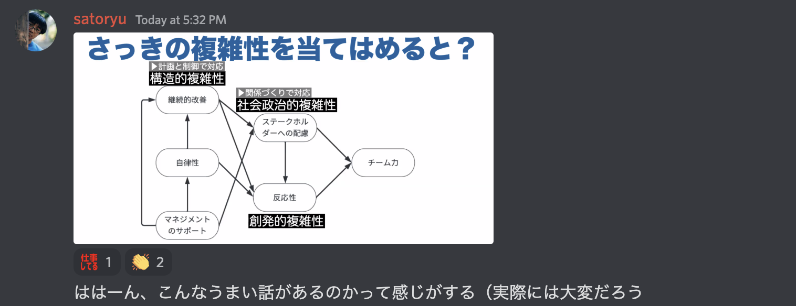

---
# try also 'default' to start simple
theme: default
# random image from a curated Unsplash collection by Anthony
# like them? see https://unsplash.com/collections/94734566/slidev
background: https://source.unsplash.com/ASKeuOZqhYU
# apply any windi css classes to the current slide
class: 'text-center'
# https://sli.dev/custom/highlighters.html
highlighter: shiki
# show line numbers in code blocks
lineNumbers: false
# some information about the slides, markdown enabled
info: |
  スクラムフェスト大阪2022 栃木トラックでの発表資料
# persist drawings in exports and build
drawings:
  persist: false
fonts:
  sans: 'M PLUS 1'
  serif: 'Zen Antique Soft'
  mono: 'Source Code Pro'
---

# 音のような言葉
## 〜ちゃちゃっとチャットで楽しむちょっとしたコツ〜

Tatsuya Sato (satoryu)

2022-06-18 Scrum Fest Osaka 2022

<BottomRightCaption>

  Photo by [Jason Rosewell](https://unsplash.com/@jasonrosewell?utm_source=unsplash&utm_medium=referral&utm_content=creditCopyText)
  on [Unsplash](https://unsplash.com/collections/Mfs_1JsiaKU/sfo2022?utm_source=unsplash&utm_medium=referral&utm_content=creditCopyText)

</BottomRightCaption>

---
layout: statement
---

# 音のような言葉

---
layout: iframe
url: http://ayamimuto.com/
---

# 武藤彩未

---
layout: section
---

# 思考実験

---
layout: default
---

# 想像してみてください

- 参加したかったオンライン勉強会当日に急用のため不参加
- 気になったので、あとからテキストチャットを見に行った

---
layout: image-left
image: discord-silent-channels.png
---

# どのように感じますか？

<v-clicks>

- 誰も参加してない？
- そもそも行われなかった？
- 何もわからない…

</v-clicks>

---
layout: image-left
image: discord-unread-channels.png
---

# どのように感じますか？

<v-clicks>

- 人がいたっぽい
- おそらく開催された
- 賑やか
- 煩そう

</v-clicks>

---
layout: statement
---

# 何か響くものがある

そんな気がしません？

---
layout: section
---

# 「で、お前誰よ？」

自己紹介

---
layout: image-left
image: https://scontent-nrt1-1.xx.fbcdn.net/v/t1.6435-9/40139780_10214519338749686_2122301906851201024_n.jpg?_nc_cat=110&ccb=1-7&_nc_sid=730e14&_nc_ohc=bHUhbduhsFMAX_P8cfc&_nc_ht=scontent-nrt1-1.xx&oh=00_AT8XoyxCXEQxIQ4Q6drSNfqSxId-CvH0wDxEERUEqQZlgw&oe=62C659D9
---

# さとうたつや

プログラマー。

- GitHub: [@satoryu](https://github.com/satoryu)
- Twitter: [@sato_ryu](https://twitter.com/sato_ryu)

## 趣味

- [BABYMETAL](https://babymetal.com/)
- [武藤彩未](http://ayamimuto.com/)
- アリの飼育
- 駄洒落

---
layout: image-right
image: https://scontent-nrt1-1.xx.fbcdn.net/v/t39.30808-6/288651033_10224612573474246_6534815944102022460_n.jpg?_nc_cat=111&ccb=1-7&_nc_sid=730e14&_nc_ohc=-mzsiVpWfaUAX_iCMPQ&tn=hUxJSasXOXAX7zhg&_nc_ht=scontent-nrt1-1.xx&oh=00_AT-WFAhj2FlCepE8G_odO0aNXtkSJhpiDX8t3xuchddCtg&oe=62B23BBD
---

# アリの飼育

女王アリを捕まえて、育てています。

- クロヤマアリ
- トビイロシワアリ
- キイロシリアゲアリ
- トビイロケアリ

クロオオアリを捕まえたい。

---
layout: iframe-right
url: https://ant-nest-viewer.netlify.app/
---

# アリの巣を見たい

実際の巣の3Dデータを手に入れたので、
ブラウザで見えるようにしてみた。

---
layout: iframe-right
url: https://www.satoryu.com/business/
---

# 個人事業主をしています。

- Webアプリケーションの開発
- プログラミング学習の支援

具体的でなくてもいいので、何か話をしてみたいと思ったらお気軽にご連絡ください。

---

# Silver Bullet Club所属

Silver Bullet Clubというエンジニアチームに所属しています。

---
layout: iframe
url: https://silver-bullet.club/blog/2021/09/01/teamfa2nd.html
---

# チームFA宣言していました。

---
layout: statement
---
# 転職先、決まりました！

## 7月から新しい会社で働きます！

---
layout: section
---

# ちなみに

---
layout: statement
---

# お給料UPします！

---
layout: statement
---

# そのために
# やってきたことがあります

---
layout: image
image: https://source.unsplash.com/ICwuKvw9QJk
---

# 懸垂

<BottomRightCaption>

  Photo by [Lawrence Crayton](https://unsplash.com/es/@nextfnlevel?utm_source=unsplash&utm_medium=referral&utm_content=creditCopyText) on [Unsplash](https://unsplash.com/collections/Mfs_1JsiaKU/sfo2022?utm_source=unsplash&utm_medium=referral&utm_content=creditCopyText)

</BottomRightCaption>

---
layout: quote
---

# 「え？懸垂？」

---
layout: iframe
url: https://en.wikipedia.org/wiki/Chin-up
---

# Chin-up

---
layout: statement
---

# 懸垂
# →Chin-up
# →チンアップ
# →賃アップ

---
layout: section
---

# 本題

---
layout: statement
---

# 本日伝えたいこと

---
layout: image-right
image: https://source.unsplash.com/P5MXtYfgmmw
---

# 無茶苦茶 わいわいしていこう！

<v-click>

## もちろんテキストで。

</v-click>

<BottomRightCaption>

Photo by [Nathan Dumlao](https://unsplash.com/@nate_dumlao?utm_source=unsplash&utm_medium=referral&utm_content=creditCopyText) on [Unsplash](https://unsplash.com/s/photos/kids-playing?utm_source=unsplash&utm_medium=referral&utm_content=creditCopyText)

</BottomRightCaption>

---
layout: image-right
image: https://source.unsplash.com/npxXWgQ33ZQ
---

# テキストチャットの重要性

- COVID-19によりリモートでコミュニケーションをとることが増えた
- オンラインミーティングが発達
  - しかし、同期的なのでオフラインのようなコストがかかる
- 非同期としてチャットツールの利用が増加

<BottomRightCaption>

  Photo by [Glenn Carstens-Peters](https://unsplash.com/@glenncarstenspeters?utm_source=unsplash&utm_medium=referral&utm_content=creditCopyText) on [Unsplash](https://unsplash.com/s/photos/text-chat?utm_source=unsplash&utm_medium=referral&utm_content=creditCopyText)

</BottomRightCaption>

---

# コミュニティでも同様

- 同じくオンライン開催が増えた
- オンラインミーティングツールとチャットツールの併用が当たり前に。

---
layout: section
---

# テキストチャットが
# 与えてくれるもの

---

# テキストチャットが与えてくれるもの

1. 雰囲気を残せる
2. 講演者を安心させる
3. 体験を作る

---
layout: section
---

# 雰囲気を残せる

---

# オフライン参加での残し方

- 発表スライド
- 動画
- ブログ

---
layout: image-right
image: https://source.unsplash.com/jaOeFnmzfsw
---

# 発表スライド

- 講演者がどのような情報を元に話をしたのかがわかる
- 説明的な文章ではなかったり
- 講演の場で話されたことは残らない

<BottomRightCaption>

Photo by [Slidebean](https://unsplash.com/@slidebean?utm_source=unsplash&utm_medium=referral&utm_content=creditCopyText) on [Unsplash](https://unsplash.com/?utm_source=unsplash&utm_medium=referral&utm_content=creditCopyText)

</BottomRightCaption>

---
layout: image-right
image: https://source.unsplash.com/FpWaEa2_d5w
---

# 動画

- 発表スライドよりも、その場で起きたことがわかる
- 講演者がどう振る舞ったのかが観れる
- 参加者がどう受け取ったのかがわかりづらい

<BottomRightCaption>

Photo by [Osarugue Igbinoba](https://unsplash.com/@osarugue?utm_source=unsplash&utm_medium=referral&utm_content=creditCopyText) on [Unsplash](https://unsplash.com/?utm_source=unsplash&utm_medium=referral&utm_content=creditCopyText)

</BottomRightCaption>
---
layout: image-right
image: https://source.unsplash.com/3GZNPBLImWc
---

# ブログ

- 発表者、参加者が文章として残した記録
- 映像に残っていないことや感情や講演以外の情報もある
- あくまで、いち個人の目線

<BottomRightCaption>

Photo by [Kenny Eliason](https://unsplash.com/@neonbrand?utm_source=unsplash&utm_medium=referral&utm_content=creditCopyText) on [Unsplash](https://unsplash.com/s/photos/blog?utm_source=unsplash&utm_medium=referral&utm_content=creditCopyText)

</BottomRightCaption>

---

# オンライン参加での残し方

- 発表スライド
- 動画アーカイブ公開
- ブログ
- **テキストチャット** ←

---
layout: image-right
image: https://source.unsplash.com/gUIJ0YszPig
---

# テキストチャット

- 講演中に参加者によって書き残される
- 講演者や参加者同志での対話やその場で感じたことが残される
- 後から見た人が、講演中の雰囲気をより感じ取り易い

<BottomRightCaption>

Photo by [Austin Distel](https://unsplash.com/@austindistel?utm_source=unsplash&utm_medium=referral&utm_content=creditCopyText) on [Unsplash](https://unsplash.com/s/photos/slack?utm_source=unsplash&utm_medium=referral&utm_content=creditCopyText)

</BottomRightCaption>

---
layout: section
---

# 講演者を安心させる

---
layout: image-right
image: https://source.unsplash.com/1K9T5YiZ2WU
---

# 講演者を安心させる

- 講演者はいろんな不安がある
  - そもそも音が聞こえているのか
  - 興味を引きつけているか
  - メッセージが届いているのか
- テキストで反応してあげるだけで不安を解消

<BottomRightCaption>

Photo by [Tim Gouw](https://unsplash.com/@punttim?utm_source=unsplash&utm_medium=referral&utm_content=creditCopyText) on [Unsplash](https://unsplash.com/s/photos/anxious?utm_source=unsplash&utm_medium=referral&utm_content=creditCopyText)

</BottomRightCaption>

---
layout: section
---

# 体験を作る

---
layout: section
---

# オンライン参加だから
# できること

---
layout: statement
---

# 講演中におしゃべり

---
layout: image-right
image: https://source.unsplash.com/lp1AKIUV3yo
---

# 講演中におしゃべり

- テキストは邪魔になりにくい
  - 講演者の声をさえぎらない
  - 他の参加者の邪魔にならない
- 参加者同志でその場で議論できる
- 質問を講演者が拾ってくれたり

<BottomRightCaption>

Photo by [Mimi Thian](https://unsplash.com/@mimithian?utm_source=unsplash&utm_medium=referral&utm_content=creditCopyText) on [Unsplash](https://unsplash.com/s/photos/conversation?utm_source=unsplash&utm_medium=referral&utm_content=creditCopyText)

</BottomRightCaption>

---
layout: statement
---

# テキストチャットが
# 講演中の体験を作る

---
layout: statement
---

# 無茶苦茶
# わいわいしていこう！

<v-click>

## もちろんテキストで。

</v-click>

---
layout: image-right
image: max16011508-2_TP_V.jpeg
---

# でも、それってコミュニティだけの話でしょ？

<BottomRightCaption>

[フリー写真素材ぱくたそ](https://www.pakutaso.com)

</BottomRightCaption>

---

# チャットが盛り上がると、生産性も高まるらしい

- テキストチャットの投稿が多いと、コミット数が多くなるという研究論文がある
- ネガティブ、ポジティブな発言であるかは関係ないらしい

## 参考

- [[2004.09786] Chat activity is a better predictor than chat sentiment on software developers productivity](https://arxiv.org/abs/2004.09786)

---
layout: statement
---

# 仕事でも
# 無茶苦茶
# わいわいしていこう！

<v-click>

## もちろんテキストで。

</v-click>

---
layout: image-right
image: https://source.unsplash.com/49uySSA678U
---

# で、どうやるの？

<BottomRightCaption>

Photo by [Simone Secci](https://unsplash.com/@simonesecci?utm_source=unsplash&utm_medium=referral&utm_content=creditCopyText) on [Unsplash](https://unsplash.com/s/photos/question?utm_source=unsplash&utm_medium=referral&utm_content=creditCopyText)

</BottomRightCaption>

---
layout: statement
---

# ちゃちゃっとできる
# テキストチャットの
# Tips

---
layout: two-cols
---

# 過去の投稿を振り返った

とりあえず煩い人です

過去の自分の投稿を一通り見返して、
Tipsを探してみました。

::right::

---

# ちゃちゃっとできるテキストチャットのTips

1. オウム返し
2. 黄色い声援
3. 共感を示す
4. 情報屋
5. 画像職人
6. ボケる

---
layout: image-right
image: https://source.unsplash.com/_VrrhJih3bs
---

# オウム返し

- 聞いていて心にひっかかった言葉を書く
- 意見や感想などは書かず、フレーズや単語だけでいい
- 講演者にとって、メッセージが届いていることの安心感

## 例

まさにこのスライドだと
> オウム返し

<BottomRightCaption>

Photo by [Joe Richmond](https://unsplash.com/@joedesigner?utm_source=unsplash&utm_medium=referral&utm_content=creditCopyText) on [Unsplash](https://unsplash.com/s/photos/parrot?utm_source=unsplash&utm_medium=referral&utm_content=creditCopyText)

</BottomRightCaption>

---
layout: image-right
image: ./yellow-cheers-example.png
---

# 黄色い声援

- 講演開始時に、講演者の名前を呼ぶ。
- 講演者のために参加していることを講演者に確実に認知させる

---

# 共感を示す

- わかった、というそれだけを伝えよう。
- 講演者にだけでなく、他の参加者に対しても

## 例

ほんの一言だけでもOK

- > わかる
- > それな

---
layout: image-right
image: https://source.unsplash.com/LPylXWfMpgE
---

# 情報屋

- 調べたURLをそのままテキストチャットに貼り付けよう
  - オンライン参加だと、聞きながらWeb検索ができる。
- もしかしたら他の参加者も知りたいかもしれない
- キーワードでググって1件目を共有するだけでも効果アリ

<BottomRightCaption>

Photo by [Ali Hajian](https://unsplash.com/@alisvisuals?utm_source=unsplash&utm_medium=referral&utm_content=creditCopyText) on [Unsplash](https://unsplash.com/s/photos/detective?utm_source=unsplash&utm_medium=referral&utm_content=creditCopyText)

</BottomRightCaption>

<!--

たとえば、さっき紹介した論文を後で詳しく読みたいとか思ったら、
タイトルで検索して、URLをチャットに貼るだけです。

https://arxiv.org/abs/2004.09786

-->

---
layout: image-right
image: https://source.unsplash.com/EoCwQ5PerAs
---

# 画像職人

- 講演中のキーワードを検索して、見つけた画像を共有しよう
- インパクトのあったスライドのスクリーンショットを共有しよう
- 言葉だけだと伝わりづらいこともある

<BottomRightCaption>

Photo by [Kim Becker](https://unsplash.com/@ksbphotography?utm_source=unsplash&utm_medium=referral&utm_content=creditCopyText) on [Unsplash](https://unsplash.com/s/photos/photographer?utm_source=unsplash&utm_medium=referral&utm_content=creditCopyText)

</BottomRightCaption>

---

# こんな感じ

ただ貼るだけ

---
layout: image-right
image: https://source.unsplash.com/aTuAKskNy7Y
---

# ボケる

- くだらない事を思いついたら書いてみる
  - スライドのキーワードに絡んだ駄洒落を書いてみよう
- 「どんなことを書いても良い」雰囲気作り
  - 和やかな雰囲気が出せる（かも
- メッセージを持ち帰りやすくする（はず
  - インパクトがあって覚えやすい（はず

<BottomRightCaption>

Photo by [Steve Harrris](https://unsplash.com/@stevemyra?utm_source=unsplash&utm_medium=referral&utm_content=creditCopyText) on [Unsplash](https://unsplash.com/s/photos/comedy?utm_source=unsplash&utm_medium=referral&utm_content=creditCopyText)

</BottomRightCaption>

---
layout: section
---

# クイズ

---
layout: section
---

# お給料を上げるためにやっていたこととは？

---
layout: image
image: https://source.unsplash.com/ICwuKvw9QJk
---

# 懸垂

<BottomRightCaption>

  Photo by [Lawrence Crayton](https://unsplash.com/es/@nextfnlevel?utm_source=unsplash&utm_medium=referral&utm_content=creditCopyText) on [Unsplash](https://unsplash.com/collections/Mfs_1JsiaKU/sfo2022?utm_source=unsplash&utm_medium=referral&utm_content=creditCopyText)

</BottomRightCaption>

---
layout: section
---

# 実践例

---
layout: section
---

# YOW

---
layout: image
image: https://files.speakerdeck.com/presentations/d6ed0f07a94a4d5e90f607d014fcd8ad/slide_0.jpg
---

<BottomRightCaption>

[シン・仮説検証 70000枚の付箋で分かった仮説検証のエッセンス / SHIN Hypothesis Testing - Speaker Deck](https://speakerdeck.com/moriyuya/shin-hypothesis-testing?slide=138)

</BottomRightCaption>

---
layout: image
image: https://files.speakerdeck.com/presentations/d6ed0f07a94a4d5e90f607d014fcd8ad/slide_137.jpg
---

# YOW

---
layout: image
image: https://files.speakerdeck.com/presentations/d6ed0f07a94a4d5e90f607d014fcd8ad/slide_138.jpg
---

# 仮説を作るときYOW

---
layout: image
image: https://files.speakerdeck.com/presentations/d6ed0f07a94a4d5e90f607d014fcd8ad/slide_139.jpg
---

# 仮説検証をふりかえるときYOW

---
layout: image
image: https://files.speakerdeck.com/presentations/d6ed0f07a94a4d5e90f607d014fcd8ad/slide_141.jpg
---

# YOW YOW 仮説検証していきましYOW！

---
layout: section
---

# まとめ

---

# テキストチャットは重要

- 雰囲気を残せる
- 講演者に安心を与える
- 体験を作る

---

# ちゃちゃっとできるテキストチャットのTips

1. オウム返し
2. 黄色い声援
3. 共感を示す
4. 情報屋
5. 画像職人
6. ボケる

---
layout: fact
---

# 今日のフェス
# はこれから！

---
layout: fact
---

# 無茶苦茶
# わいわいしていこう

<v-click>

## もちろんテキストで。

</v-click>

---

# 参考

- [武藤彩未 AYAMI MUTO ・ OFFICIAL WEB SITE](http://ayamimuto.com/)
- [[2004.09786] Chat activity is a better predictor than chat sentiment on software developers productivity](https://arxiv.org/abs/2004.09786)
- [シン・仮説検証 70000枚の付箋で分かった仮説検証のエッセンス / SHIN Hypothesis Testing - Speaker Deck](https://speakerdeck.com/moriyuya/shin-hypothesis-testing?slide=138)
